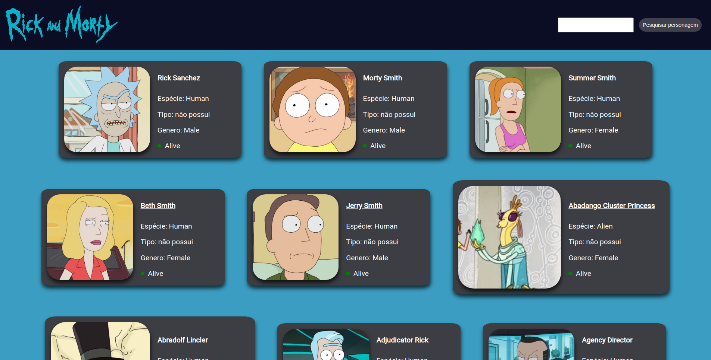
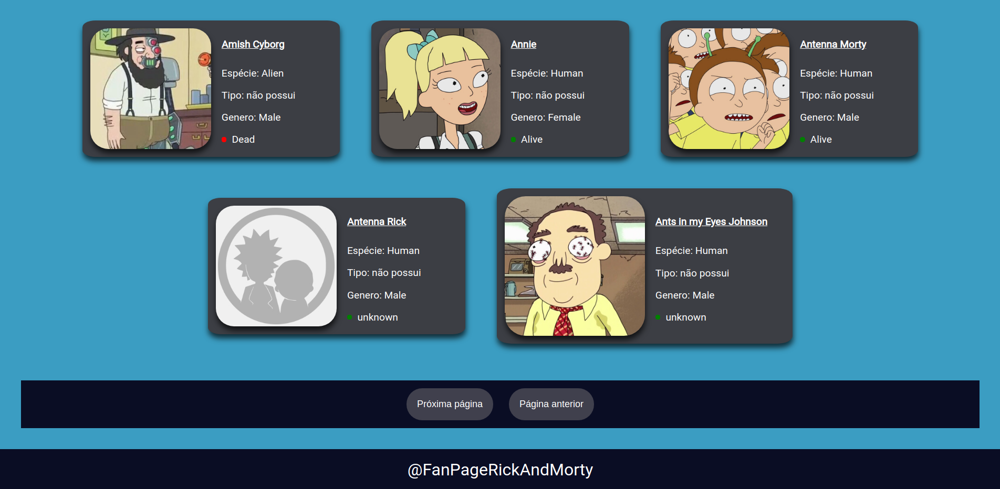
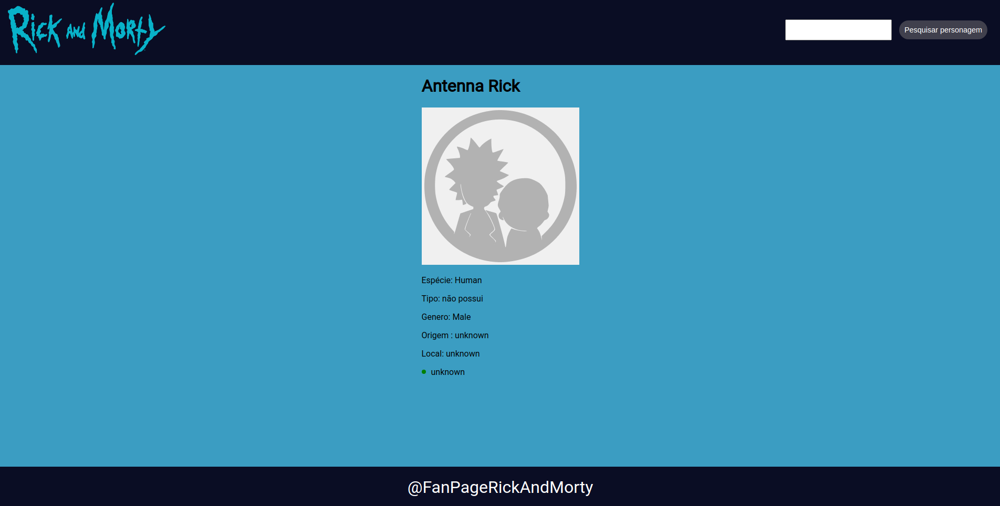
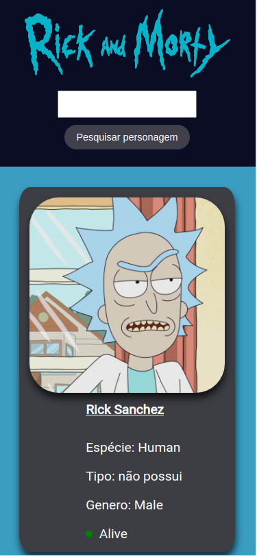
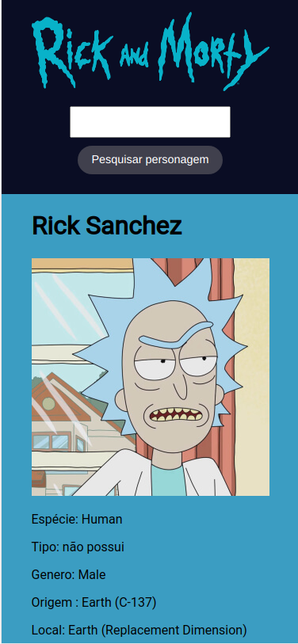

# Fan Page Rick And Morty

Page to find data about the animated series "Rick and Morty"

Data source: https://rickandmortyapi.com/ 

## Getting Started

install dependencies: <b>npm install</b>

modify css: <b>npm run gulp</b>

start project: <b>npm run dev</b>

## Built With

* [Webpack](https://webpack.js.org/)
* [Gulp](https://gulpjs.com/) 
* [Html](https://developer.mozilla.org/pt-BR/docs/Web/HTML) 
* [Css](https://developer.mozilla.org/pt-BR/docs/Web/CSS) 
* [JavaScript](https://developer.mozilla.org/pt-BR/docs/Web/JavaScript) 

## Images

</img>
</img>
</img>
</img>
</img>

## License

This project is licensed under the MIT License - see the [LICENSE.md](LICENSE.md) file for details

